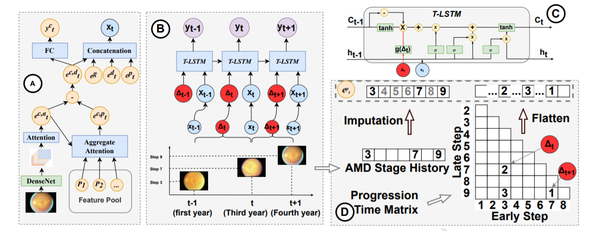
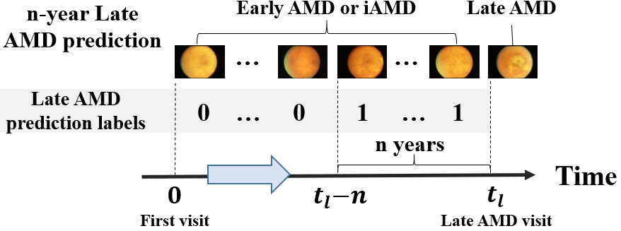
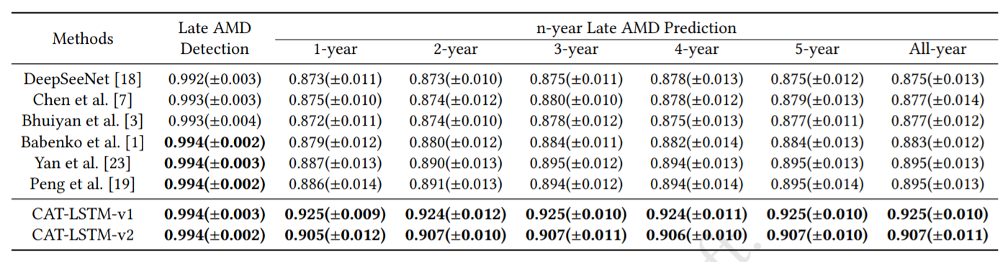
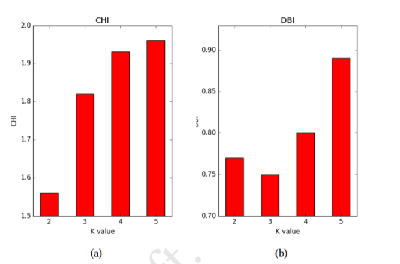
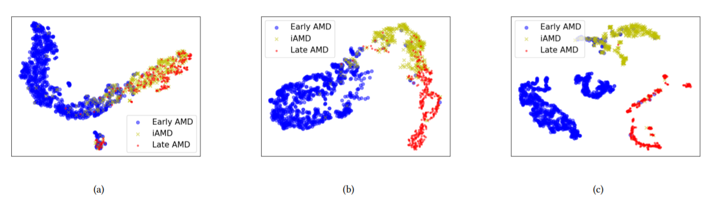
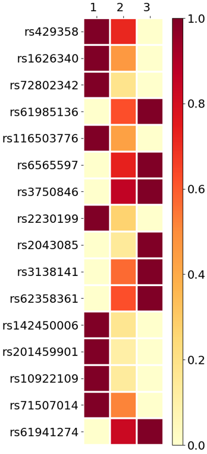

# Predicting Age-Related Macular Degeneration Progression with Contrastive Attention and Time-Aware LSTM

This repository contains the official PyTorch implementation of the following paper:

> **Predicting Age-Related Macular Degeneration Progression with Contrastive Attention and Time-Aware LSTM**<br>
> Changchang yin, Sayoko E. Moroi, Ping Zhang<br>
> [paper]()
>
> **Abstract:** *Age-related macular degeneration (AMD) is the leading cause ofirreversible blindness in developed countries. Identifying patientsat high risk of progression to late AMD, the sight-threatening stage,is critical for clinical actions, including medical interventions andtimely monitoring. Recently, deep-learning-based models have beendeveloped and achieved superior performance for late AMD prediction. However, most existing methods are limited to the colorfundus photography (CFP) from the last ophthalmic visit and do notinclude the longitudinal CFP history and AMD progression duringthe previous years’ visits. Patients in different AMD subphenotypesmight have various speeds of progression in different stages ofAMD disease. Capturing the progression information during theprevious years’ visits might be useful for the prediction of AMD progression. In this work, we propose a Contrastive-Attention-based Time-awareLongShort-TermMemory network (CAT-LSTM) topredict AMD progression. First, we adopt a convolutional neuralnetwork (CNN) model with a contrastive attention module (CA) toextract abnormal features from CFPs. Then we utilize a time-awareLSTM (T-LSTM) to model the patients’ history and consider theAMD progression information. The combination of disease pro-gression, genotype information, demographics, and CFP featuresare sent to T-LSTM. Moreover, we leverage an auto-encoder torepresent temporal CFP sequences as fixed-size vectors and adoptk-means to cluster them into subphenotypes. We evaluate the pro-posed model based on real-world datasets, and the results show thatthe proposed model could achieve 0.925 on area under the receiveroperating characteristic (AUROC) for 5-year late-AMD predictionand outperforms the state-of-the-art methods by more than 3%,which demonstrates the effectiveness of the proposed CAT-LSTM.After analyzing patient representation learned by an auto-encoder,we identify 3 novel subphenotypes of AMD patients with differentcharacteristics and progression rates to late AMD, paving the wayfor improved personalization of AMD management. *


# Framework
CAT-LSTM adopts contrastive attention module (CA) to capture abnormality from CFPs, and time-aware LSTM (T-LSTM) to model the CFP sequences and predict late AMD risks in coming years.



Given the learned CFP sequence representation vector, k-means is adopted to subtype patients' eyes into subphenotypes.


# Files Directory
    CAT-LSTM
    |
    |--code
    |
    |--file                                 * The preprocessing codes will write some files here.
    |
    |--data                                 * Put the downloaded datasets here.
    |    |--phs000001.v3.p1.c1				* Downloaded from 
    |    |    
    |    |--phs000001.v1.p1.c1              * Downloaded from 
    |
    |--result


# Data preprocessing
```
cd preprocessing
python low_reso.py
python generate_demo_file.py
python generate_label_file.py
```


# Train CAT-LSTM
```
cd code
python main.py --use-cl 0	# Obtain features for patient groups
python main.py --use-cl 1	# Predict late AMD with contrastive attention module
```

## Problem setting
Settings of n-year late AMD prediction. We predict whether patients' eyes will progress to late AMD within n years. 


# Late AMD detection and prediction results
AUROC of late AMD stage prediction. Late AMD detection denotes detecting whether the patients' AMD diseases have progressed to late stages based on information up to current visit. Late AMD prediction (1-5 years and All-year) denote predicting whether patients' AMD diseases will progress to late AMD within 1-5 years and progress to late AMD ultimately.



## K value selection for k-means
CHI and DBI across different K for k-means to cluster the CFP sequences. When K=3,  we have the best DBI value for CFP clustering. It is also the elbow point for CHI.



## tSNE visulization
Projection scatter plot of individual eyes based on features extracted by (a) CNN+LSTM, (b) CAT-LSTM (with CFP inputs up to iAMD stage) and (c) CAT-LSTM (with CFP inputs including late AMD stages).  To fairly compare with CNN+LSTM, we use CAT-LSTM-v2 (which embeds progression features based on predicted AMD stage rather than ground truth) to extrace CFP sequence features.


## subphenotype analysis (genotype information)
The distribution of AMD-associated genetic markers' alternative allele across the three subphenotypes. The subphenotypes are 1: subphenotype I; 2: subphenotype II; 3: subphenotype III.  Because the alternative allele rates of different genetic markers vary a lot, we normalize the rates when visualizing the distribution.




